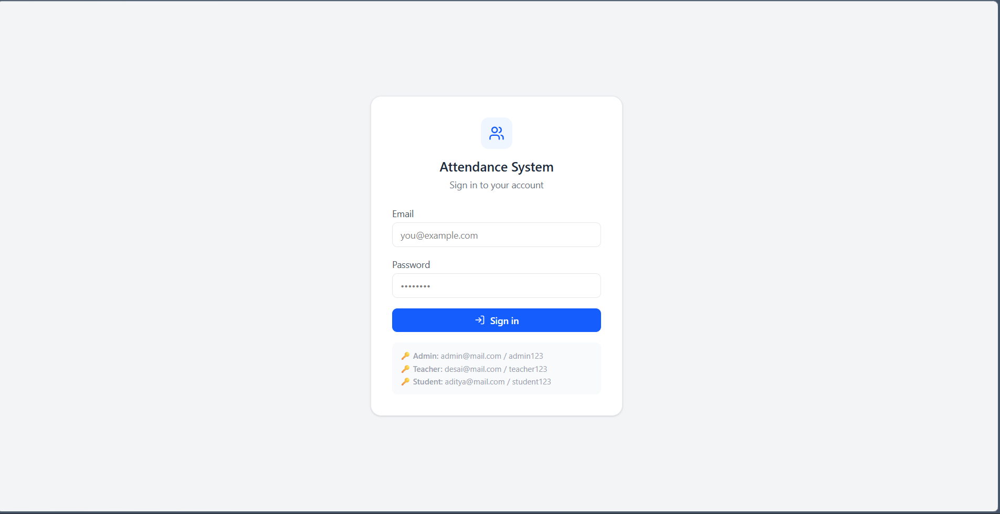
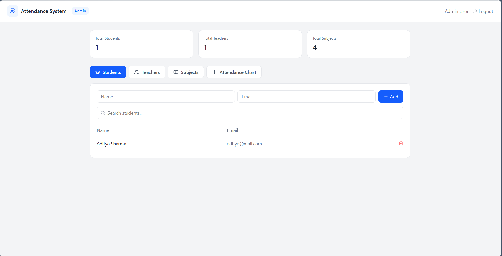
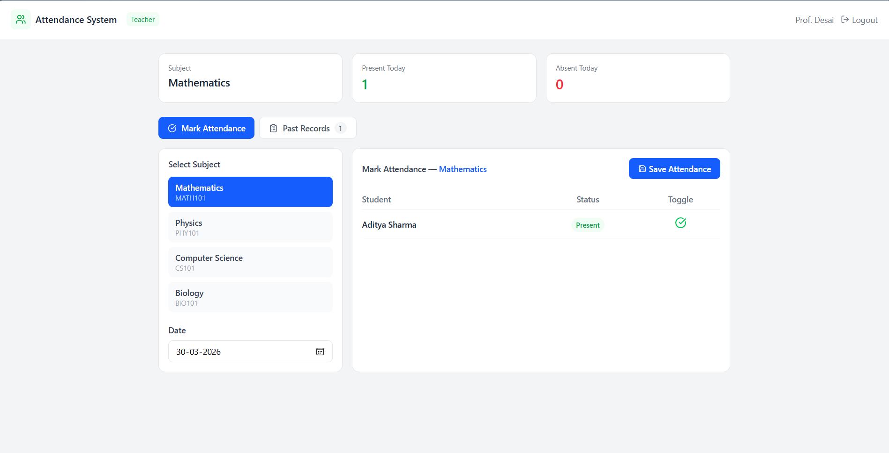
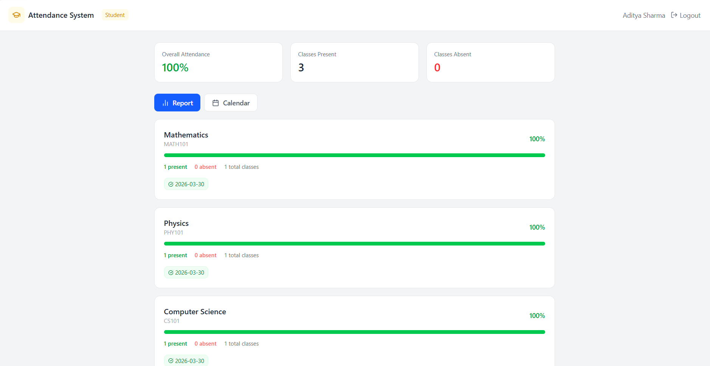

# Attendance Management System

A full-stack web application for managing student attendance built with React and Spring Boot.

## Tech Stack

**Frontend**
- React 18 + Vite
- Tailwind CSS
- Lucide React (icons)
- Recharts (charts)
- React Router DOM

**Backend**
- Java 17
- Spring Boot 3.2.5
- Spring Security + JWT
- Spring Data JPA
- H2 In-Memory Database
- Lombok

---

## Features

### Admin
- Manage students, teachers, and subjects
- Assign teachers to subjects
- Search and filter all tables
- View attendance overview chart

### Teacher
- View assigned subjects
- Mark attendance (present/absent) for any date
- View and filter past attendance records

### Student
- View personal attendance report per subject
- Progress bars showing attendance percentage
- Calendar view with colour-coded attendance dates
- Warning alert when attendance drops below 75%

---

## Project Structure
```
attendance-system/
├── attendance-frontend/          # React frontend
│   ├── src/
│   │   ├── pages/
│   │   │   ├── Login.jsx
│   │   │   ├── admin/
│   │   │   │   └── AdminDashboard.jsx
│   │   │   ├── teacher/
│   │   │   │   └── TeacherDashboard.jsx
│   │   │   └── student/
│   │   │       └── StudentDashboard.jsx
│   │   ├── api.js               # All API calls
│   │   └── App.jsx              # Routes + auth guard
│   └── package.json
│
└── attendance-management/        # Spring Boot backend
    └── src/main/java/com/attendance/
        ├── controller/           # REST API endpoints
        ├── model/                # JPA entities
        ├── repository/           # Database access
        ├── service/              # Business logic
        ├── security/             # JWT + Spring Security
        └── dto/                  # Request/Response objects
```

---

## Getting Started

### Prerequisites
- Java 17+
- Node.js 18+
- Maven

---

### Backend Setup

1. Navigate to the backend folder:
```bash
   cd attendance-management
```

2. Run the Spring Boot application:
```bash
   ./mvnw spring-boot:run
```

3. Backend runs on `http://localhost:8080`

4. H2 database console available at:
```
   http://localhost:8080/h2-console
   JDBC URL: jdbc:h2:mem:attendancedb
   Username: sa
   Password: (leave empty)
```

---

### Frontend Setup

1. Navigate to the frontend folder:
```bash
   cd attendance-frontend
```

2. Install dependencies:
```bash
   npm install
```

3. Start the development server:
```bash
   npm run dev
```

4. Frontend runs on `http://localhost:5173`

---

## Default Login Credentials

| Role    | Email              | Password     |
|---------|--------------------|--------------|
| Admin   | admin@mail.com     | admin123     |
| Teacher | desai@mail.com     | teacher123   |
| Student | aditya@mail.com    | student123   |

---

## API Endpoints

### Auth
| Method | Endpoint           | Description        |
|--------|--------------------|--------------------|
| POST   | /api/auth/login    | Login, returns JWT |

### Users
| Method | Endpoint               | Description        |
|--------|------------------------|--------------------|
| GET    | /api/users/students    | Get all students   |
| GET    | /api/users/teachers    | Get all teachers   |
| POST   | /api/users/students    | Add student        |
| POST   | /api/users/teachers    | Add teacher        |
| DELETE | /api/users/{id}        | Delete user        |

### Subjects
| Method | Endpoint                        | Description              |
|--------|---------------------------------|--------------------------|
| GET    | /api/subjects                   | Get all subjects         |
| GET    | /api/subjects/teacher/{id}      | Get subjects by teacher  |
| POST   | /api/subjects                   | Add subject              |
| DELETE | /api/subjects/{id}              | Delete subject           |

### Attendance
| Method | Endpoint                              | Description                   |
|--------|---------------------------------------|-------------------------------|
| POST   | /api/attendance/mark                  | Mark attendance               |
| GET    | /api/attendance/student/{id}          | Get student attendance        |
| GET    | /api/attendance/subject/{id}          | Get subject attendance        |
| GET    | /api/attendance/subject/{id}/date/{d} | Get attendance by date        |

---

## Database Schema
```
users
  id, name, email, password, role (ADMIN/TEACHER/STUDENT)

subjects
  id, name, code, teacher_id → users

enrollments
  id, student_id → users, subject_id → subjects

attendance
  id, student_id → users, subject_id → subjects, date, status (PRESENT/ABSENT)
```

---

## Screenshots

### Login


### Admin Dashboard


### Teacher Dashboard


### Student Dashboard


---

## Author

- **Name:** Aditya Khune
- **College:** Sir Parshurambhau College
- **Year:** 2026
```
